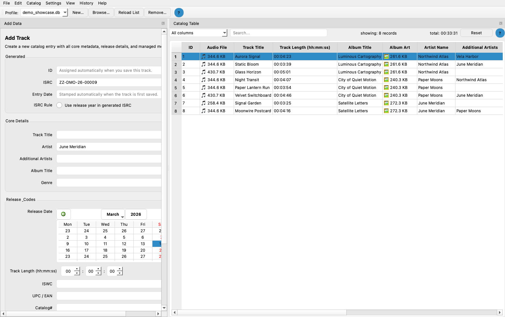
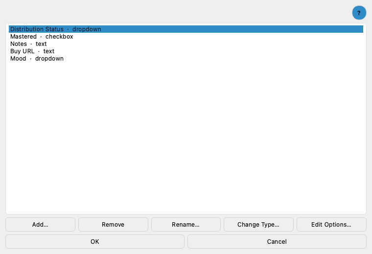
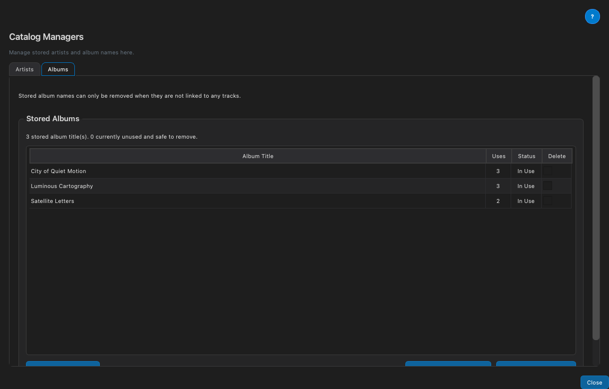
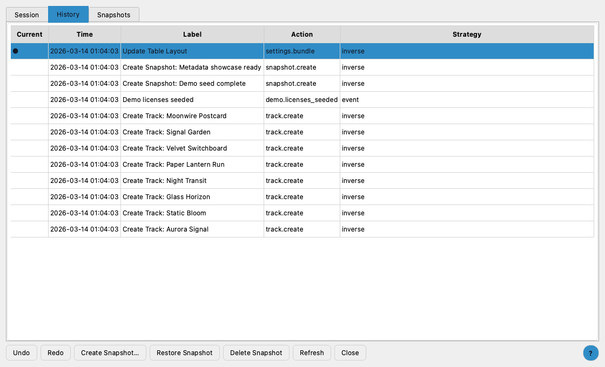
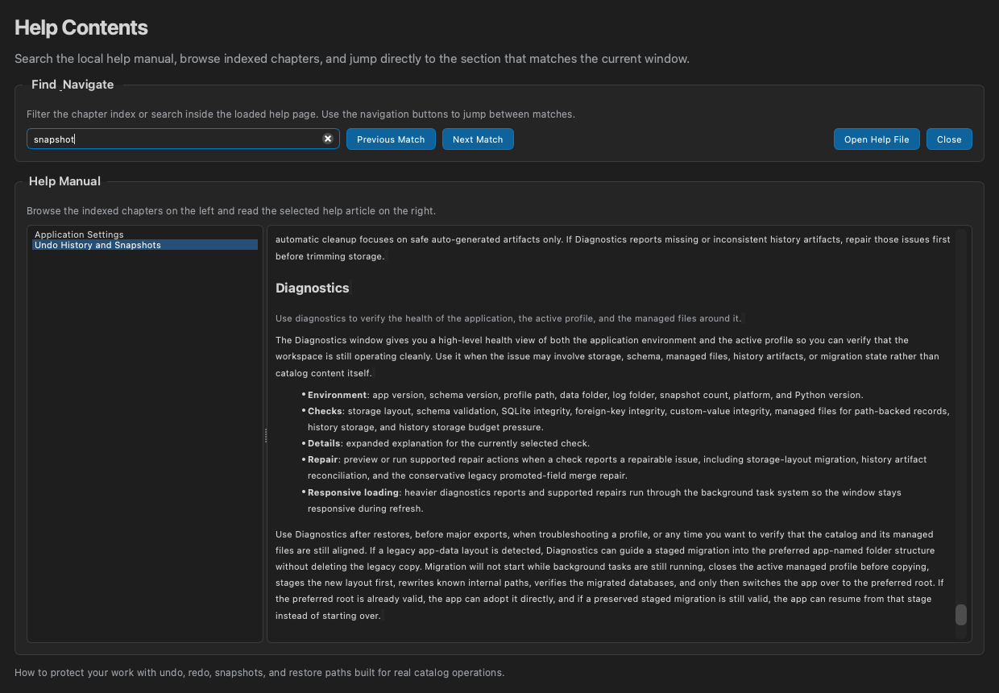

# ISRC Catalog Manager

Current product version: `3.1.1`

ISRC Catalog Manager is a local-first desktop catalog and repertoire operations workspace for artists, labels, managers, and catalog owners who need more than a basic track list.

It combines recording metadata, releases, works, parties, contracts, rights, documents, assets, GS1 product data, import and export tooling, diagnostics, and durable history into one serious working system. Everything stays on your machine, in your files, and under your control.



## What The App Covers

The app is built for the operational layer around a real music catalog. It helps you maintain:

- recordings and release metadata
- releases as first-class product records
- a central code registry for app-managed catalog numbers, contract numbers, license numbers, and Registry SHA-256 Keys
- works and composition metadata
- parties, counterparties, and reusable identities
- contracts, obligations, and managed documents
- contract and license template drafting, placeholder filling, live preview, and PDF export
- rights positions and source-agreement links
- assets, deliverables, masters, derivatives, and artwork variants
- custom metadata, GS1 workbook data, and exchange-ready fields
- diagnostics, recovery points, and managed local storage

That makes it practical to answer questions such as:

- Which recordings belong to this release, and in what order?
- Which work is linked to this track?
- Which contract and document govern this right?
- Which party granted or retained this territory?
- Which asset is the approved master?
- Which records are incomplete, broken, duplicated, or unsafe to export?

## Product Principles

### Local-first by design

Catalog data lives in SQLite profile databases on your own machine. The app does not require a hosted backend or subscription service to remain usable.

### Governed musical entry

`Add Track` is the primary single-track creation workflow, and `Add Album` is the primary grouped entry workflow. Each new recording resolves Work governance before save, so the catalog does not accumulate orphan recording rows.

### Connected repertoire model

Tracks, releases, works, parties, contracts, rights, documents, and assets stay connected. The catalog remains recording-focused, while the broader repertoire layer keeps legal, creative, and operational context within the same workspace.

### Flexible attachment storage

File-backed records support two storage modes:

- `Database` stores the raw file data in the profile database
- `Managed file` copies the file into an app-controlled local storage folder and stores the managed path

This applies across track media, artwork, custom binary fields, contract documents, asset versions, and GS1 workbook templates.

### Recoverable operations

Imports, bulk edits, restore flows, media attachment, and other higher-risk actions are designed to be reviewable, history-aware, and recoverable instead of one-way operations.

## Core Workspaces

### Catalog and workspace panels

The main catalog table supports fast searching, bulk selection, contextual actions, and direct handoff into related workflows. The most track-table-dependent tools stay available as docked workspace panels:

- Code Registry Workspace
- Release Browser
- Work Manager
- Party Manager
- Contract Manager
- Rights Matrix
- Deliverables and Asset Versions
- Global Search and Relationships

These panels remain available beside the table so you can keep browsing and selecting records while you review related release, rights, party, contract, and asset context.

### Code registry and generated keys

The `Code Registry Workspace` is the authoritative home for app-managed business codes and generated keys.

It supports:

- internal catalog, contract, and license number categories with configurable prefixes
- generated internal codes in the `<PREFIX><YY><NNNN>` format
- a separate `Registry SHA-256 Key` category for secure generated registry keys
- external identifiers that do not match the internal format
- shared usage counts when the same catalog identifier is linked to multiple tracks or releases
- linking unassigned generated values later from the workspace itself

The registry is intentionally separate from audio authenticity. `Registry SHA-256 Key` values are not watermark keys, do not replace authenticity signing keys, and use their own workflows in editors, templates, and the workspace.

### Assets and deliverables

Tracks and releases can carry multiple asset versions, including approved masters, alternates, artwork variants, and derivatives. The deliverables workspace combines:

- `Asset Registry` for primary-version control and approved-source review
- `Derivative Ledger` for managed export batches, derivative lineage, and retained output review

### Audio authenticity and provenance

The app supports authenticity-aware audio delivery workflows:

- local Ed25519 signing keys
- direct authentic master export for WAV, FLAC, and AIFF
- provenance-sidecar delivery for supported lossy derivatives
- authenticity verification from selected catalog audio or external files

The authenticity claim comes from the signed manifest. The keyed watermark links direct master exports back to that signed record, while lossy derivatives are verified through signed lineage.

### Import, attach, and exchange

The import layer is a reviewed workflow surface rather than a blind file picker. The app supports:

- catalog exchange import for XML, CSV, XLSX, JSON, and ZIP package sources
- template-driven conversion for external CSV, XLSX, and repeat-node XML import sheets, including recurring PRO upload sheets such as SENA work-registration layouts
- Party import
- Contracts and Rights import
- audio-tag import
- reviewed bulk audio attachment and single-file album-art attachment
- package round-tripping with preserved storage-mode behavior

### Contract and license templates

The `Contract Template Workspace` is a dockable drafting surface for placeholder-driven contract
and license templates.

It supports:

- importing Pages, DOCX, HTML, and HTML package sources
- preserving the original imported source file unchanged
- symbol lookup through the placeholder catalog and symbol generator
- fill-form drafting against authoritative catalog, party, contract, rights, and owner data
- live HTML preview from the current editable draft state
- PDF export from the same HTML working draft used for preview

For the best fidelity, print-safe HTML templates are ideal. Pages and DOCX imports still work, but
they are normalized into HTML working drafts behind the scenes so preview and export stay
consistent.

The repository also includes a bundled print-safe starter package at
[HTML license template/README.md](HTML license template/README.md). It ships as a seven-page
HTML remix-license example with companion `banner.png` and `footer-logo.png` assets, and it
demonstrates owner, party, track, manual, `db.contract.license_number`, and
`db.contract.registry_sha256_key` placeholders on the app's preferred HTML-native path. Use it as
a starting point, not as legal advice, and customize the content for your own workflow and
jurisdiction before relying on it.

### Quality, diagnostics, and recovery

Operational safety is part of the product. The app includes:

- a Data Quality Dashboard for catalog issues
- diagnostics and guided repairs for environment, schema, storage, managed files, and history health
- persistent undo and redo
- manual snapshots, restore paths, and registered backups
- retention and cleanup controls

### Theme builder and advanced QSS

The visual theme builder covers typography, surfaces, buttons, inputs, navigation, data views, progress surfaces, media badge icons, and geometry controls. Advanced QSS remains available for the final edge cases that need selector-level styling.

## Integrated Documentation

The in-app help system is the primary user-facing manual.

- Open `Help > Help Contents` for the integrated quick-start and deep-dive documentation surface.
- Use [docs/README.md](docs/README.md) for repository-side companion guides.
- Use the implementation handoffs only for internal continuity and engineering history.

## Key Menus

- `File`: profiles, exchange import and export, backups, and restore
- `Edit`: governed track and album entry, selection editing, and clipboard actions
- `Catalog`: workspace tools, audio workflows, GS1, quality review, and repair queues
- `Settings`: application settings and authenticity keys
- `View`: columns, ribbon visibility, action ribbon customization, and table layout controls
- `History`: undo, redo, snapshots, and history review
- `Help`: the integrated manual, diagnostics, logs, and local support surfaces

## Technology

The desktop application is built with:

- Python
- PySide6
- SQLite
- openpyxl
- mutagen
- pillow

The architecture is local-first, desktop-native, and designed for safe background task execution with SQLite-aware threading patterns.

Advanced users can go further with a selector reference and syntax-aware QSS editor that supports safe autocomplete, rule templates, pseudo-states, subcontrols, and object-name targeting.

## Power Features Easy To Miss

Some of the strongest workflow features are easy to underestimate from a quick skim:

- the docked workspace keeps Code Registry Workspace, Release Browser, Work Manager, Party Manager, Contract Manager, Rights Matrix, Asset Registry, Global Search, and Catalog Managers open beside the table as tabbed panels
- the Code Registry Workspace separates app-managed internal codes from external identifiers, shows shared usage counts, and lets you link an unassigned generated value later
- the Contract Template Workspace can import Pages, DOCX, HTML, and HTML packages, keep the original source untouched, and drive drafting, preview, and PDF export from one HTML working draft
- exchange import can classify canonical internal-looking catalog values into the internal registry, keep non-conforming values as external identifiers, and report accepted, external, mismatch, skipped, merged, and conflicted outcomes explicitly
- the deliverables workspace pairs the Asset Registry with a Derivative Ledger for managed export batches, lineage review, and safe cleanup
- layout and dock state are remembered, so the app reopens as a real workstation instead of a fixed single screen
- the action ribbon can be customized around your high-frequency commands
- repeat imports can remember per-format choices, and unwanted incoming fields can be skipped explicitly instead of being mapped by accident
- `Catalog > Audio > Import & Attach > Bulk Attach Audio Files…` can match filenames and tags to existing tracks, attach them in one reviewed batch, and optionally update matched artist names
- global search and relationship browsing give the richer catalog model a usable navigation layer
- package exchange can carry managed files and restore their recorded storage mode on import
- audio tag import workflows can preview conflicts before writing metadata into the catalog, while catalog-backed audio exports embed metadata automatically and plain external conversion stays metadata-free
- history settings include retention and safety presets, storage budgets, and cleanup prompts that enforce a hard retained-snapshot cap while preserving the current visible undo boundary
- theme tooling goes beyond colors into starter themes, optional hint text, a live preview pane, app-wide preview, BLOB badge icons, selector discovery, and QSS autocomplete

## Who It Is For

ISRC Catalog Manager is especially useful for:

- independent artists maintaining their own release history
- boutique labels managing a developing catalog
- catalog managers cleaning up metadata across legacy projects
- publishers and rights coordinators who need a reliable local reference
- teams that want durable, local files instead of browser-only workflows

## Product Scope

The app is designed to be the catalog brain for independent music operations.

It is intentionally not built for:

- royalty accounting
- royalty statement ingestion
- distributor or DSP APIs
- payment workflows
- release pitching or distributor campaign management

That focus is deliberate. The goal is depth and reliability in catalog maintenance, repertoire knowledge, and agreement tracking.

## Workflow Overview

### 1. Build or import the catalog

Use `Add Track` for single governed musical items, `Add Album` for batch governed entry, `Work Manager` for work governance and follow-up, exchange import when catalog data already exists elsewhere, or `Catalog > Audio > Import & Attach > Bulk Attach Audio Files…` when track rows already exist but their media still needs to be attached. Incoming structured data can be previewed, mapped, skipped field-by-field, matched, merged, or inserted as new records depending on the source and the job.

### 2. Organize the repertoire graph

Create releases, works, parties, contracts, rights, and asset versions as first-class records. Link them across the catalog so tracks, compositions, agreements, deliverables, and supporting documents stay connected.

Use the docked workspace panels to keep those managers open as tabbed companions to the track table rather than as one-at-a-time modal dialogs.

Use the same workspace model for contract and license templates when you need placeholder-aware
drafting, live HTML preview, and PDF export without mutating the original imported source file.

### 3. Review, clean up, and verify

Run the quality dashboard, inspect findings, open the affected records, and use diagnostics when the issue may involve managed files, storage layout, history artifacts, legacy field collisions, or storage-budget pressure rather than catalog content alone. For deliverables work, keep the Derivative Ledger open beside the table so export batches, retained files, lineage, and authenticity review stay visible while you clean up or verify related catalog records.

### 4. Export, package, or archive safely

Use XML, CSV, XLSX, JSON, GS1 workbook export, repertoire exchange, or ZIP package export depending on the workflow. Snapshots, backups, cleanup, and restore paths help protect the catalog before major operations.

## Screenshots

The screenshots below are regenerated from the bundled demo workspace and captured with the bundled `VS Code Dark` theme so the public docs reflect the current polished desktop presentation.

### Workspace


### Custom Fields



### Catalog Managers



## Workspace Design

ISRC Catalog Manager is built around a dockable desktop workspace rather than a fixed single-screen layout.

- `Add Data` and the `Catalog Table` remain the two primary day-to-day docks.
- Catalog tools that benefit from live track-table interaction open as tabbed workspace panels.
- Related views can stay open together, which makes release assignment, work linking, rights review, contract review, license lookup, and relationship browsing much faster.
- Layout and dock state are remembered, so the app reopens the way you work.

The result is a catalog environment that feels closer to a professional desktop workstation than a sequence of forms.

### History and Snapshots



### In-app Help



## Documentation

Start with `Help > Help Contents` inside the app for the integrated manual, then use [`docs/README.md`](docs/README.md) for repository-side companion pages.

### User Guides

- [Documentation Hub](docs/README.md)
- [Import and Merge Workflows](docs/import-and-merge-workflows.md)
- [Catalog Workspace Workflows](docs/catalog-workspace-workflows.md)
- [Contract Template Workflows](docs/contract-template-workflows.md)
- [Diagnostics and Recovery](docs/diagnostics-and-recovery.md)
- [Attachment Storage Modes](docs/file_storage_modes.md)
- [Repertoire Knowledge System](docs/repertoire_knowledge_system.md)
- [GS1 Workflow Guide](docs/gs1_workflow.md)
- [Theme Builder Guide](docs/theme_builder.md)
- [Undo, History, and Snapshots](docs/undo_redo_strategy.md)

### Developer / Internal Docs

- [Modularization Strategy](docs/modularization_strategy.md)
- [Implementation Handoffs](docs/implementation_handoffs/)

The application includes a searchable in-app help browser that serves as the primary user-facing manual for workflow, reference, diagnostics, and recovery topics.

## Demo Workspace

The repository includes a demo database and sample media in the `demo/` folder so you can explore the workflow without starting from an empty profile.

## Installation

### Option 1: Build a release package

Run:

```bash
python build.py
```

The build script follows a deterministic release workflow:

- use the current project metadata and `ISRC_manager.py` as the fixed entrypoint
- on Windows, prefer a repo-local `.venv\Scripts\pyinstaller.exe` when present before falling back to other PyInstaller launch methods
- resolve packaged branding from `build_assets/icons/app_logo.*`
- bundle the runtime splash asset from `build_assets/splash.*`
- build with PyInstaller using the platform policy in the script
- stage the release artifact under `dist/release/`
- write a `dist/release_manifest.json` alongside the staged output

To customize the packaged branding, replace the files in `build_assets/icons/` and `build_assets/` with the same filenames and extensions you want the build to use.

Typical asset layout:

```text
build_assets/
  icons/
    app_logo.png
    app_logo.ico
    app_logo.icns
  splash.png
```

The build flow is designed not to package or overwrite your existing profile databases.

### Option 2: Run from source

Create an environment, install dependencies, and start the app directly:

```bash
python -m venv .venv
source .venv/bin/activate
python -m pip install -r requirements.txt
python ISRC_manager.py
```

On Windows, activate the environment with:

```powershell
.venv\Scripts\activate
```

## Typical Use

Once launched, you can:

- create a new profile database
- browse to an existing profile
- add tracks and grouped album data
- bulk-attach audio files to existing tracks
- maintain releases, works, parties, contracts, rights, and assets
- import or export metadata
- open GS1 metadata for a single track or a selected batch
- run quality checks, diagnostics, and repair workflows
- tune snapshot retention, cleanup posture, and history storage budgets
- preview media, inspect logs, and create snapshots

## Standards and Responsibility

The app helps manage recognized industry identifiers and workflows such as ISRC, ISWC, UPC/EAN, GS1 workbook exports, and local registration metadata. It does not replace the responsibilities of your collection society, label operations, legal review, or official registration authority. It is best understood as the organized local system where you maintain and verify those details.

## Technology

ISRC Catalog Manager is built with:

- Python
- PySide6
- SQLite
- openpyxl
- mutagen
- pillow

The architecture is local-first, desktop-native, and designed for safe background task execution with SQLite-aware threading patterns.

## Developer Workflow

Install developer tooling with:

```bash
python -m pip install -r requirements-dev.txt
```

Run the main quality checks with:

```bash
python -m ruff check build.py isrc_manager tests
python -m black --check build.py isrc_manager tests
python -m mypy
python -m unittest discover -s tests -p 'test_*.py'
python -m coverage run -m unittest discover -s tests -p 'test_*.py'
python -m coverage report
```

Or use the bundled shortcuts:

```bash
make lint
make format-check
make type-check
make test
make coverage
make all-checks
```

## CI and Reliability

GitHub Actions verifies the project with:

- byte-compilation checks
- Ruff linting
- Black formatting checks
- mypy type checking
- unit and integration tests on multiple Python versions
- headless Qt app-shell coverage
- coverage thresholds
- packaging smoke validation

The test suite includes service-level coverage, dialog/controller tests, app-shell integration coverage, workflow integration tests, migration coverage, and background-task safety checks.

## Support

If you find a bug or want to improve the project, open an issue or pull request on GitHub. The application is especially suitable for self-managed and independent catalog operations, and the repository is structured to support continued expansion without losing its local-first character.

## License

See [license.md](license.md).
