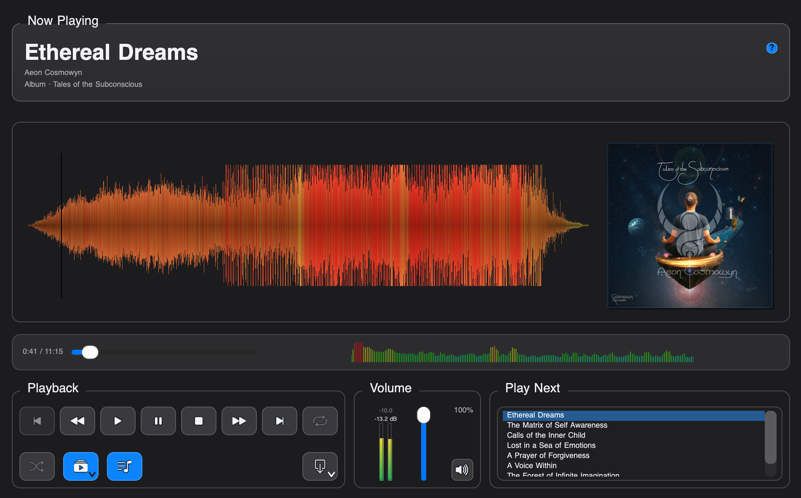

# Media Player

The Audio Player is the catalog-side auditioning surface for attached audio. It opens from media preview actions and stays as a reusable top-level window, so you can keep it beside the catalog while you review tracks, filter the table, inspect artwork, and run exports.

## Playback Surface

- `Now Playing` shows the current title, artist, and album context.
- The waveform stage supports click, drag, and slider scrubbing.
- The bookmark button saves per-track waveform positions, lists saved bookmarks, jumps back to a selected timestamp, and removes bookmarks from that track's list.
- Album artwork appears beside the waveform when available. Clicking the artwork opens it in the image preview.
- The spectrum graph and peak meters show playback activity and fade smoothly when playback is paused or stopped.
- Volume and mute are available in the player without changing catalog metadata.
- The EQ button opens equalizer bands and a stereo pan dial for temporary auditioning.

## Transport And Queue

- Transport buttons cover previous, rewind, play, pause, stop, fast-forward, next, and loop.
- Loop cycles through off, playlist loop, and current-track loop.
- `Play Next` follows the current visible catalog order and includes only tracks that have playable media for the current source.
- Shuffle rearranges the available Play Next queue.
- Auto Advance controls whether the player moves to the next queued track when playback ends.
- Album Playlist opens a menu with Off plus each album in the profile. Selecting an album narrows Play Next to that album, loads the first playable track without starting playback, and keeps shuffle inside that scoped queue.

## Export

The export button uses the app's existing export workflows for the current track and preview source. Depending on the media source and profile state, the menu can include catalog audio copies, managed derivatives, authenticity exports, provenance exports, forensic watermarked audio, and custom-field audio BLOB export.

## App Sounds

`Settings > Application Settings > Sounds` controls the bundled app-wide sounds:

- startup after the application finishes loading
- notice feedback for completed actions such as settings import/export
- warning feedback when the app reports a problem

Each bundled sound can be switched on or off independently. Startup, completed-action notice, and warning sounds are available; scrolling does not trigger application audio feedback.

All bundled application sound effects were designed and created by Aeon Cosmowyn.
